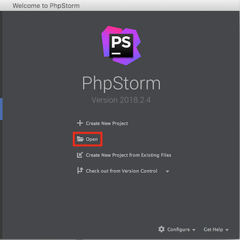
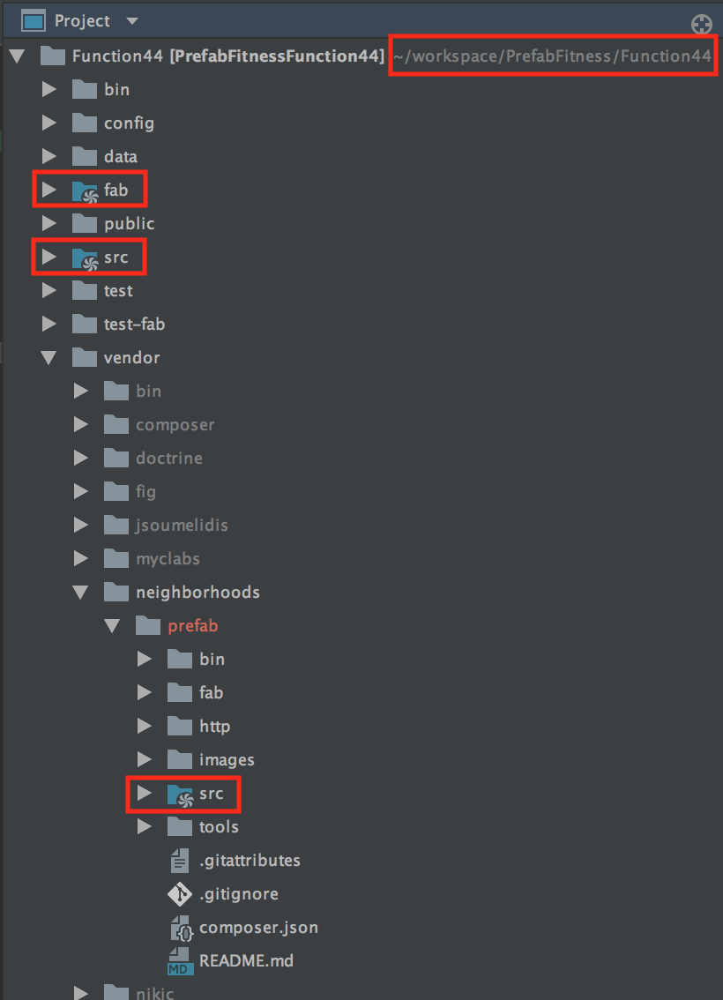
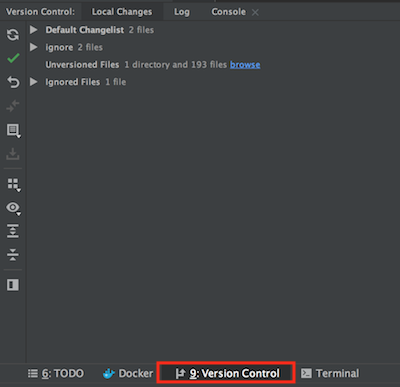

# Fitness Function 44

## Proven Use Case
One simple `DAO` is correctly fabricated.

## Setup
```bash
cd Function44
composer update
```

## PHPStorm
* Start a new project by opening the `Function44` directory in the `PrefabFitness` git repo.

* Disable `composer.json` syncing (if not PHPStorm will forget your directory preferences).
* Set `src` and `fab` to "For generated sources" as `Neighborhoods\PrefabFitnessFunction44\`.
* Set `vendor/neighborhoods/prefab/src` as a Source.
* Enable "For generated sources" for `vendor/neighborhoods/prefab/src` as `Neighborhoods\Prefab`.

* Additionally, in order to get the Version Control Tool Window to appear it may be necessary to choose.
    * View
    * Tool Windows
    * Version Control
    * You should now see
    


## Running Prefab
1. Execute
```bash
cd Function44
vendor/bin/prefab gen:fab
```
2. Revert `.gitignore`
